# Helpers and grammar

High-level helpers combine data preparation with plotnine layers. Use
`gganndata` when the required data are per-cell fields that map directly to
aesthetics. Use a helper when the plot also needs aggregation, ordering, or
specialized preparation.

The snippets on this page stay on `pbmc68k_reduced` so they match the committed
reference images; the tutorials and vignettes use `pbmc3k_processed`. Both are
real 10x PBMC data and the helper/grammar equivalences hold on either.

The complete reference constructions are in
[`examples/grammar_equivalents.py`](https://github.com/mdmanurung/ggann/blob/main/examples/grammar_equivalents.py).
The test suite builds both the helper calls and those constructions. The two
paths are not image-comparison tests.

## Per-cell data

An embedding needs only resolved coordinates and an observation column:

```python
import scanpy as sc
import ggann as ag
from ggann import aes, gganndata
from plotnine import geom_point

adata = sc.datasets.pbmc68k_reduced()
group = "bulk_labels"

helper = ag.plot_embedding(adata, "umap", color=group)

grammar = (
    gganndata(adata, aes("UMAP_1", "UMAP_2", color=group))
    + geom_point(size=1.5, alpha=0.9)
    + ag.scale_color_obs(adata, group)
    + ag.theme_ggann()
)
```

The helper additionally applies embedding-axis styling and categorical legend
defaults.

## Aggregated data

Dotplots require a mean and an expressing-cell fraction for every group and
gene. That preparation happens before plotnine draws the points:

```python
import annplyr as ap
from plotnine import aes, geom_point, ggplot, scale_color_cmap, scale_size

genes = ["CD3D", "NKG7", "CST3", "GNLY"]

mean = adata.ap.summarize(
    raw={g: ap.mean(ap.col(g)) for g in genes},
    by=group,
)
fraction = adata.ap.summarize(
    raw={g: ap.mean(ap.col(g) > 0) for g in genes},
    by=group,
)

mean = mean.melt(
    id_vars=group,
    var_name="feature",
    value_name="mean_expression",
)
fraction = fraction.melt(
    id_vars=group,
    var_name="feature",
    value_name="fraction",
)
summary = mean.merge(fraction, on=[group, "feature"])

grammar = (
    ggplot(summary, aes("feature", group))
    + geom_point(aes(size="fraction", color="mean_expression"))
    + scale_color_cmap(cmap_name="Reds")
    + scale_size(range=(0.5, 8.0))
    + ag.theme_ggann()
)
```

`plot_dotplot` also preserves requested gene order, observation-category order,
and split-group behavior.

## Complete helper-to-grammar map

Every plotnine-native helper can be reproduced by preparing the stated table
and adding ordinary plotnine layers. The helper remains preferable when it also
owns validation, source selection, category ordering, or a non-trivial
statistic.

| Helper | Prepared data | Grammar recipe |
|---|---|---|
| `plot_embedding` | Two `obsm` coordinates plus optional colour/split fields | `gganndata + geom_point` |
| `plot_features` | Coordinates and expression, pivoted by feature | `ggplot + geom_point + facet_wrap` |
| `plot_density` | Coordinates plus pyNebulosa feature density | `ggplot + geom_point + scale_color_cmap` |
| `plot_embedding_density` | Coordinates plus two-dimensional KDE | `ggplot + geom_point` faceted by group |
| `plot_dotplot` | Group/gene mean and fraction expressing | `ggplot + geom_point(size=..., color=...)` |
| `plot_dotplot_grouped` | Dotplot table plus gene-set labels | Dotplot recipe plus grouped x-axis facets |
| `plot_matrixplot` | Group/gene mean | `ggplot + geom_tile` |
| `plot_matrixplot_grouped` | Matrix table plus gene-set labels | Matrix recipe plus grouped x-axis facets |
| `plot_heatmap` | Per-cell long expression table | `ggplot + geom_tile` |
| `plot_violin` | Per-cell long expression table | `ggplot + geom_violin + facet_wrap` |
| `plot_stacked_violin` | Per-cell long expression table | Violin recipe with one row per feature |
| `plot_tracksplot` | Per-cell long expression ordered by group | `ggplot + geom_col + facet_grid` |
| `plot_box` | Per-cell long expression table | `ggplot + geom_boxplot` and optional points |
| `plot_sina` | Per-cell long expression table | `ggplot + plotnine_extra.geom_sina` |
| `plot_ridge` | Per-group KDE curves on an offset grid | `ggplot + geom_ribbon + geom_line` |
| `plot_expression_bar` | Group mean and uncertainty | `ggplot + geom_col + geom_errorbar` |
| `plot_expression_line` | Mean expression by x/group | `ggplot + geom_line + geom_point` |
| `plot_proportions` | annplyr cell counts, optionally normalized | `ggplot + geom_col`, `geom_area`, or `geom_line` |
| `plot_correlation` | Group mean profiles and correlation matrix | `ggplot + geom_tile` |
| `plot_dendrogram` | SciPy dendrogram link coordinates | `ggplot + geom_line` |
| `plot_rank_genes_dotplot` | `rank_genes_df` plus dotplot summary | Ranked selection followed by dotplot recipe |
| `plot_rank_genes_matrixplot` | `rank_genes_df` plus group means | Ranked selection followed by matrix recipe |
| `plot_volcano` | Differential-expression result table | `ggplot + geom_point` and optional repel labels |
| `plot_ma` | Mean abundance and fold-change table | `ggplot + geom_point` and optional repel labels |
| `plot_qc_violin` | Long observation-metric table | `ggplot + geom_violin + facet_wrap` |
| `plot_qc_scatter` | Two resolved per-cell fields plus colour | `gganndata + geom_point` |
| `plot_highest_expr_genes` | Per-cell fractions for top-ranked genes | `ggplot + geom_boxplot` |
| `plot_variance_ratio` | PCA variance-ratio vector | `ggplot + geom_point + geom_line` |

`plot_clustermap` and `plot_upset` are grid-backend escape hatches and therefore
have no plotnine grammar equivalent. The representative executable
constructions in `examples/grammar_equivalents.py` expose the exact table/layer
boundary for the most common recipes.

## Rendered references

These images show the convenience calls beside the corresponding reference
constructions from `examples/grammar_equivalents.py`.

| Helper | Convenience call | Reference construction |
|---|:---:|:---:|
| `plot_embedding` | 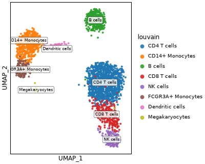 | 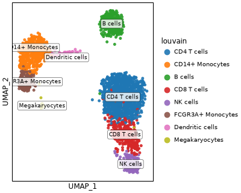 |
| `plot_features` | 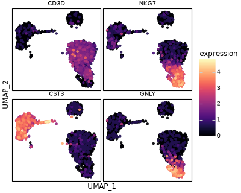 | 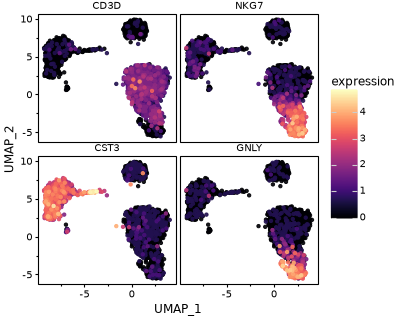 |
| `plot_density` | 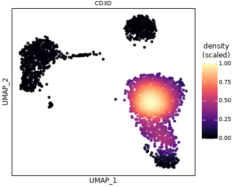 | 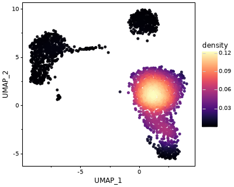 |
| `plot_dotplot` |  | 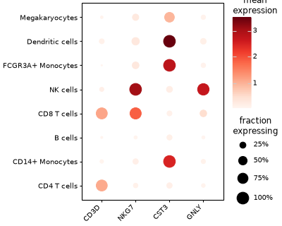 |
| `plot_matrixplot` | 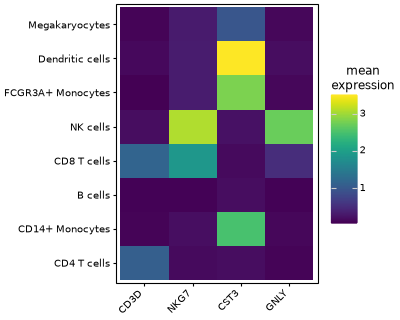 |  |
| `plot_violin` | 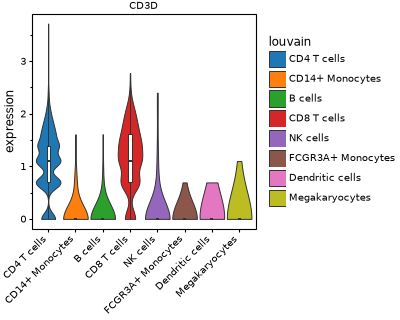 | 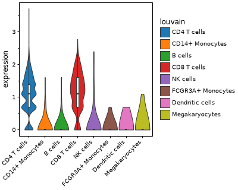 |
| `plot_box` | 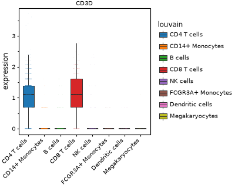 | 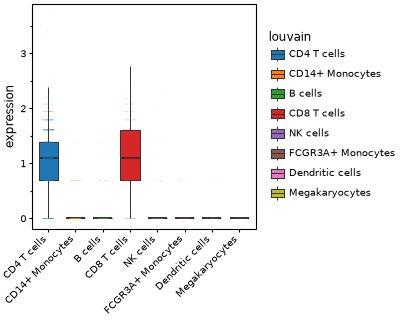 |
| `plot_expression_bar` | 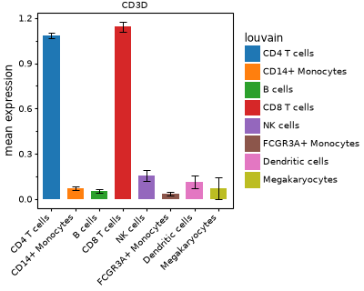 | 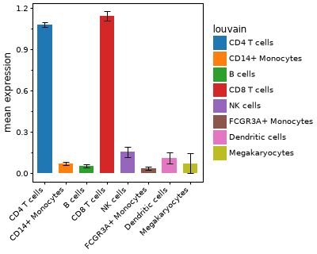 |
| `plot_expression_line` | 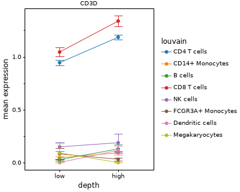 | 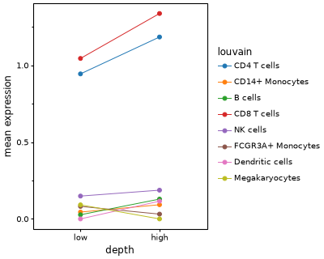 |
| `plot_proportions` | 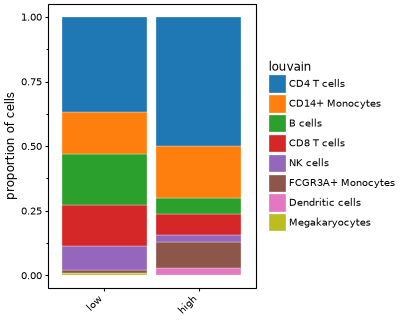 | 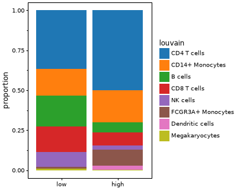 |
| `plot_correlation` | 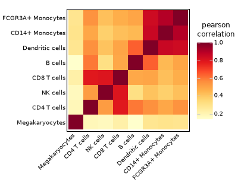 | 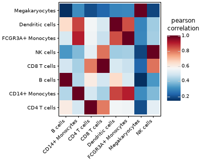 |

`plot_clustermap` and `plot_upset` use grid-based backends and do not have a
plotnine grammar construction.
