# Gallery

[`examples/gallery.py`](https://github.com/mdmanurung/ggann/blob/main/examples/gallery.py)
generates the family examples from `pbmc68k_reduced`; the publication pair is
generated by `examples/vignettes/05_publication_panels.py`.

## Exploratory to publication-ready

::::{grid} 1 1 2 2

:::{grid-item}
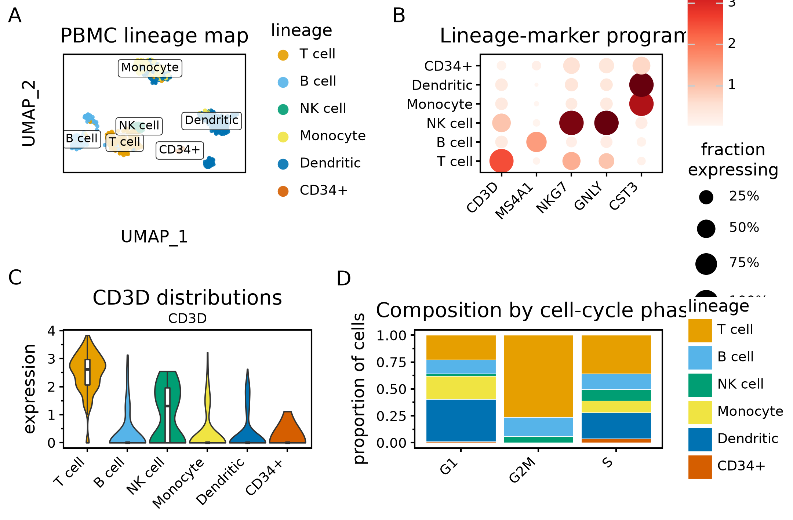
:::

:::{grid-item}
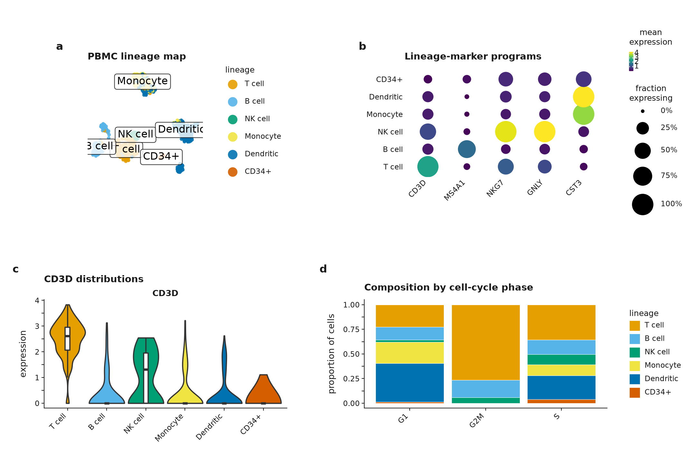
:::

::::

The {doc}`vignettes/publication_panels` workflow uses the same embedding,
dotplot, log-normalized expression distribution, and composition summaries in both
figures. Publication mode coordinates final-size typography, palettes, axes,
guides, unequal panel widths, 2 mm gaps, and lowercase tags; an exact DataFrame
comparison proves the scientific preparation is unchanged. The final exporter
writes editable SVG/PDF plus exact-size PNG/TIFF from one figure object.

## Embeddings

::::{grid} 1 1 2 2

:::{grid-item}
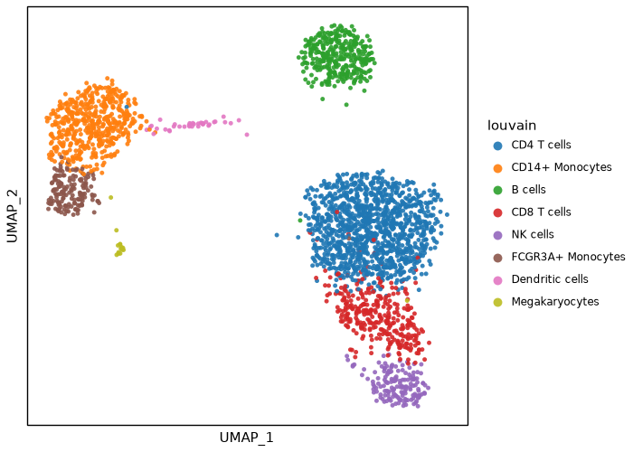
:::

:::{grid-item}
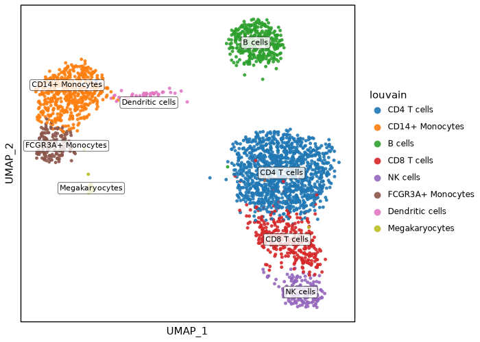
:::

::::

`plot_embedding` colours cells by a categorical or numeric field. Set
`label=True` to add repelled category labels.

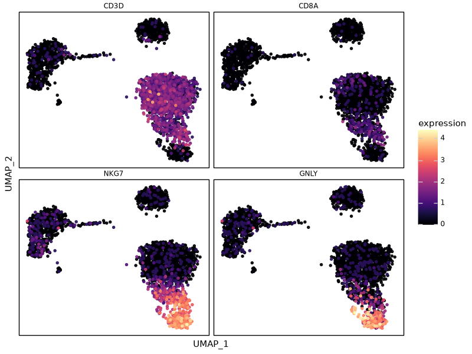

`plot_features` uses one panel per feature and a shared colour scale.

## Gene-weighted density

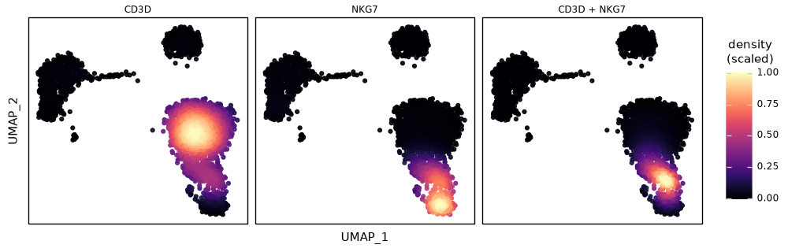

`plot_density` uses pyNebulosa for weighted kernel density. Set `joint=True` to
add a joint panel.

## Markers and expression

::::{grid} 1 1 2 2

:::{grid-item}
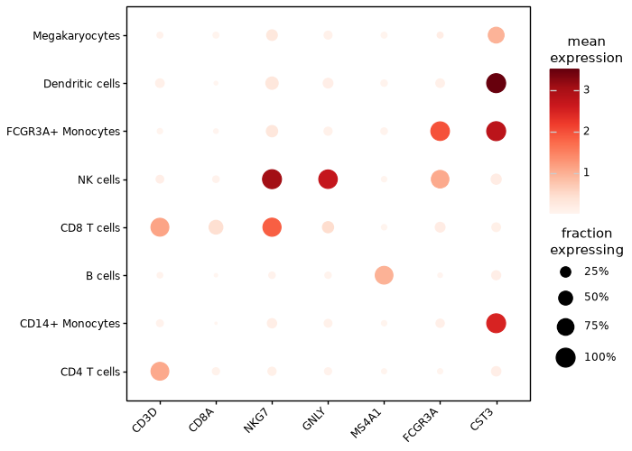
:::

:::{grid-item}
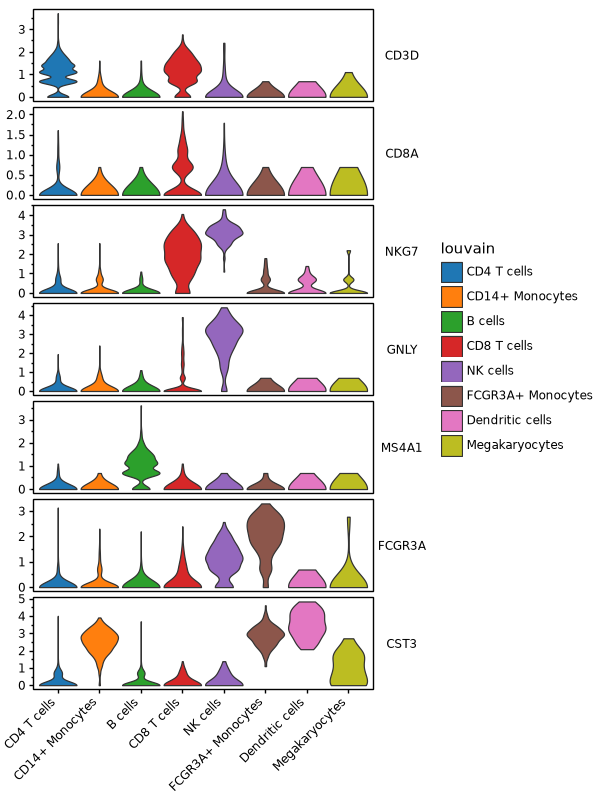
:::

:::{grid-item}
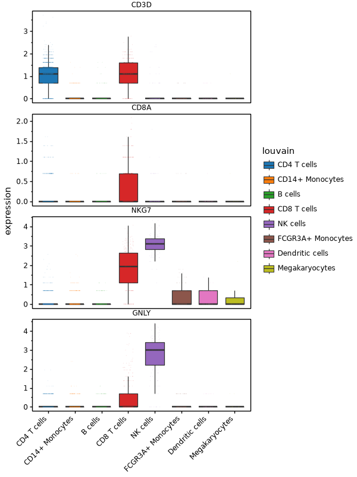
:::

:::{grid-item}
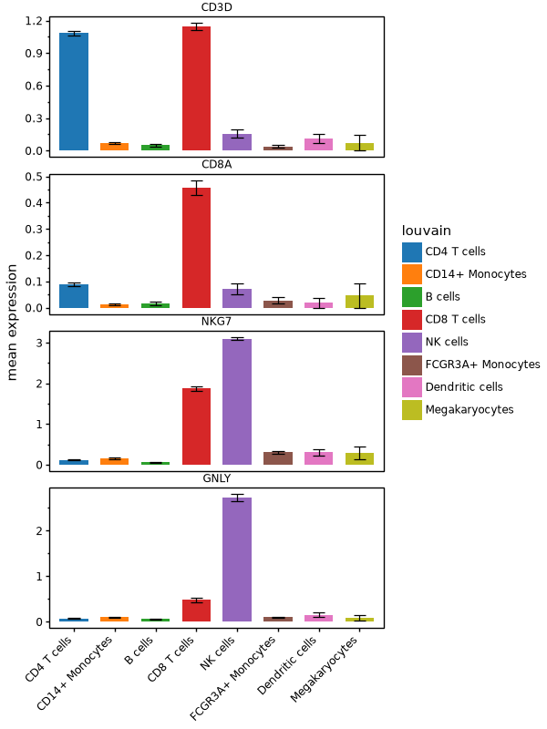
:::

::::

The panels show `plot_dotplot`, `plot_stacked_violin`, `plot_box`, and
`plot_expression_bar`.

## Differential expression

::::{grid} 1 1 2 2

:::{grid-item}
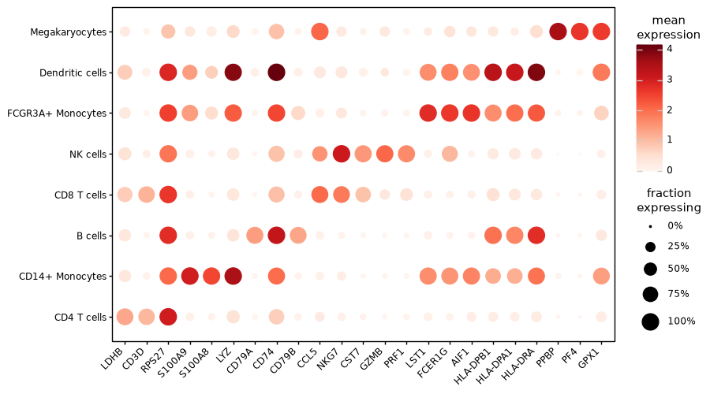
:::

:::{grid-item}
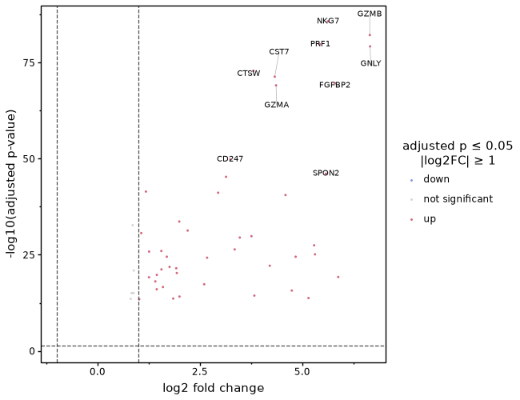
:::

::::

The panels show `plot_rank_genes_dotplot` and `plot_volcano`.

## Composition, correlation, and sets

::::{grid} 1 1 2 2

:::{grid-item}
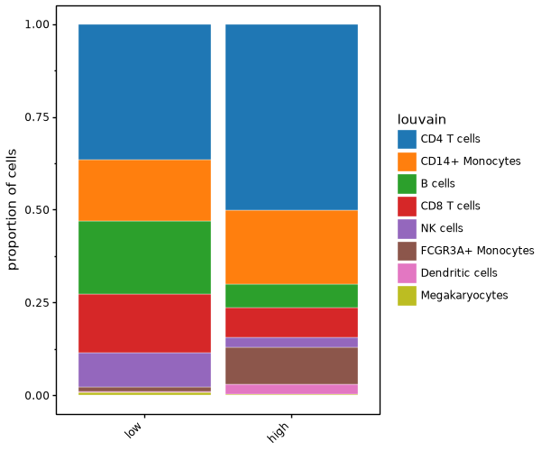
:::

:::{grid-item}
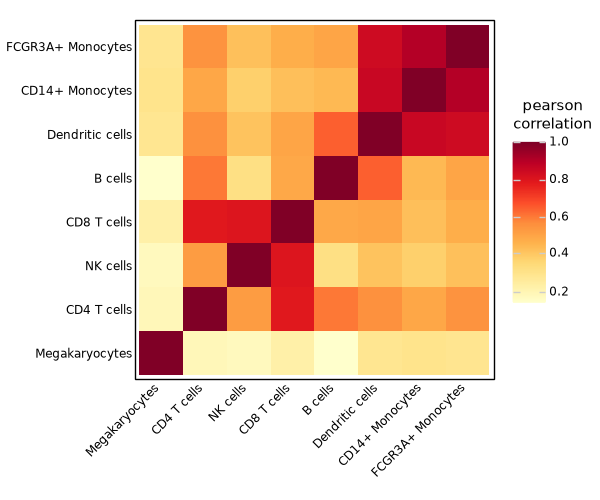
:::

:::{grid-item}
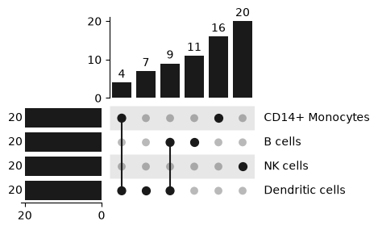
:::

:::{grid-item}
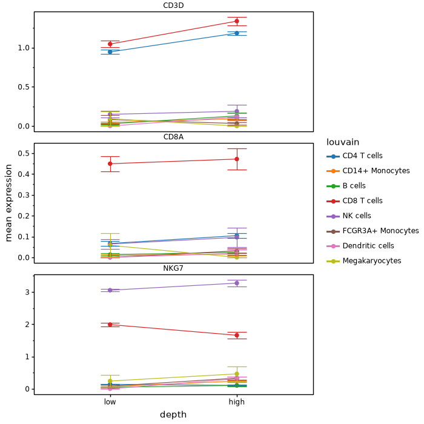
:::

::::

The panels show `plot_proportions`, `plot_correlation`, `plot_upset`, and
`plot_expression_line`.

## Quality control

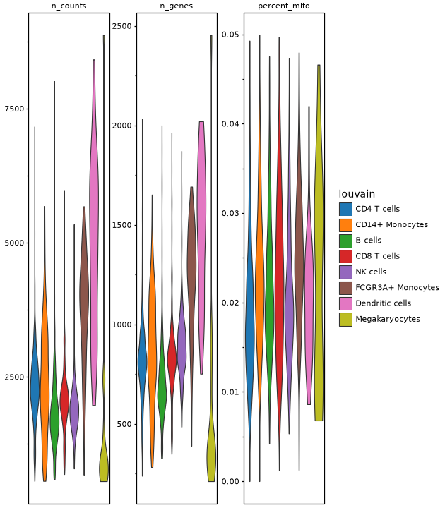

`plot_qc_violin` displays one facet per QC metric.
