# Scanpy comparisons

[`examples/reproduce_scanpy.py`](https://github.com/mdmanurung/ggann/blob/main/examples/reproduce_scanpy.py)
renders scanpy and ggann figures from the same `pbmc68k_reduced` object. The
figures use different plotting systems and are compared by represented data and
plot type, not pixel equality.

## Rendered comparisons

### Embedding

| scanpy | ggann |
|:---:|:---:|
| 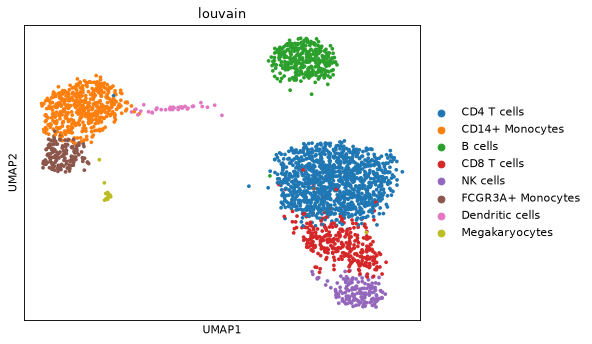 |  |

### Feature embeddings

| scanpy | ggann |
|:---:|:---:|
| 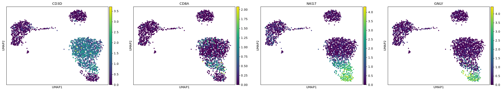 | 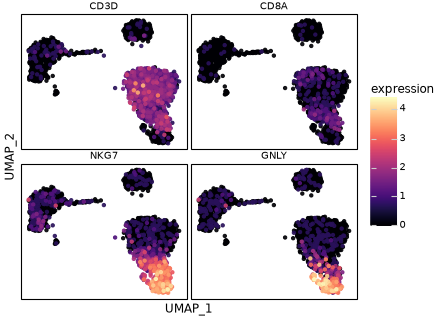 |

### Dotplot and matrixplot

| scanpy dotplot | ggann dotplot | scanpy matrixplot | ggann matrixplot |
|:---:|:---:|:---:|:---:|
| 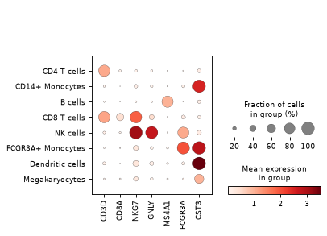 | 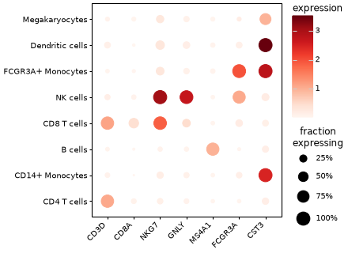 | 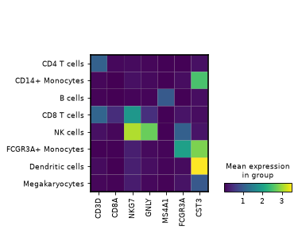 | 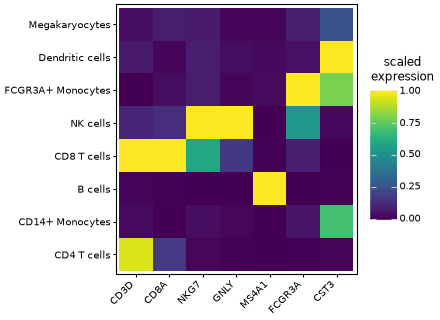 |

### Violin and tracksplot

| scanpy stacked violin | ggann | scanpy violin | ggann |
|:---:|:---:|:---:|:---:|
| 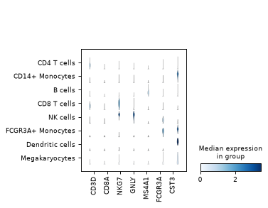 | 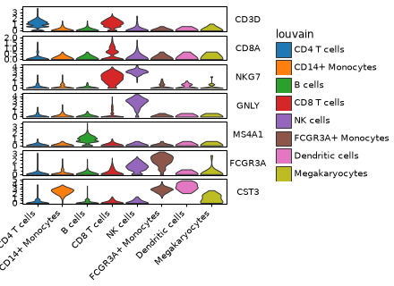 | 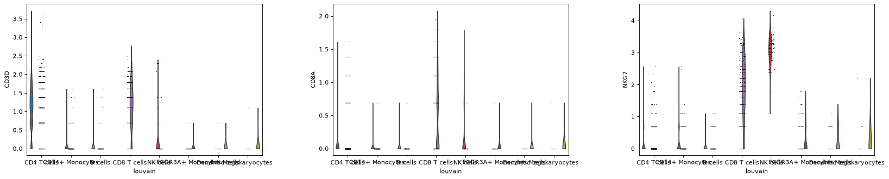 | 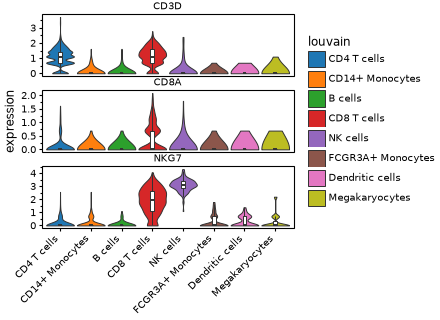 |

| scanpy tracksplot | ggann tracksplot |
|:---:|:---:|
| 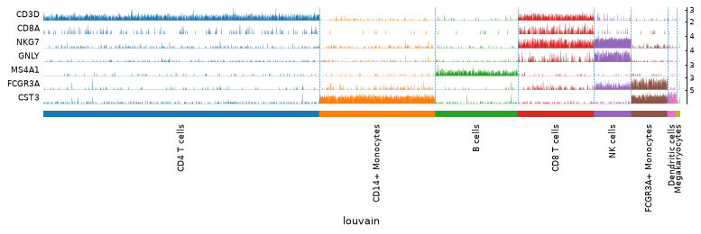 | 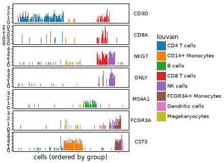 |

### Correlation, highest-expressed genes, and marker dotplot

| scanpy correlation | ggann | scanpy highest-expressed | ggann | scanpy markers | ggann |
|:---:|:---:|:---:|:---:|:---:|:---:|
| 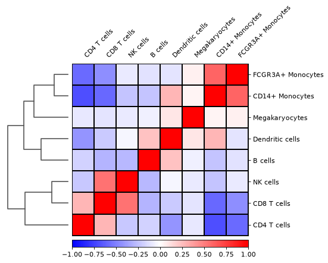 | 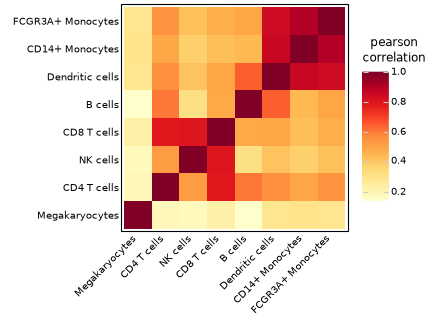 | 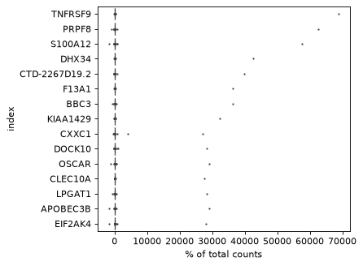 | 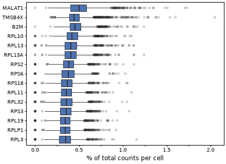 | 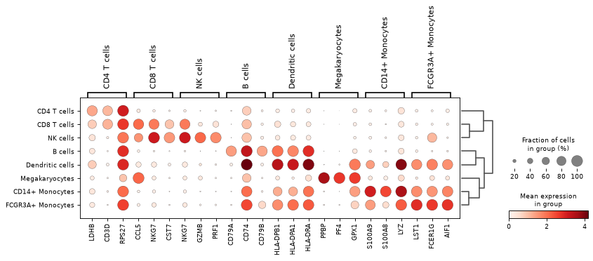 | 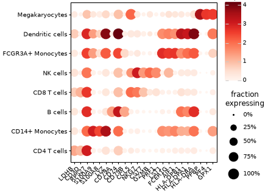 |

## Plot coverage

| scanpy | ggann | Interface |
|---|---|---|
| `sc.pl.umap`, `pca`, `tsne`, `embedding` | `plot_embedding` | Helper |
| `sc.pl.umap(color=[...])` | `plot_features` | Helper |
| `sc.pl.dotplot` | `plot_dotplot` | Helper |
| `sc.pl.matrixplot` | `plot_matrixplot` | Helper |
| `sc.pl.stacked_violin` | `plot_stacked_violin` | Helper |
| `sc.pl.violin` | `plot_violin` | Helper |
| `sc.pl.tracksplot` | `plot_tracksplot` | Helper |
| `sc.pl.correlation_matrix` | `plot_correlation` | Helper |
| `sc.pl.highest_expr_genes` | `plot_highest_expr_genes` | Helper |
| `sc.pl.rank_genes_groups_dotplot`, `matrixplot` | `plot_rank_genes_dotplot`, `plot_rank_genes_matrixplot` | Helper |
| `sc.pl.clustermap` | `plot_clustermap` | Grid-based helper |
| `sc.pl.scatter` for observation metrics | `plot_qc_scatter` | Helper |
| `sc.pl.heatmap` | `plot_heatmap` | Helper |
| `sc.pl.pca_variance_ratio` | `plot_variance_ratio` | Helper |
| `sc.pl.embedding_density` | `plot_embedding_density` | Helper with different computation |
| `sc.pl.dendrogram` | `plot_dendrogram` | Helper |
| Gene-versus-gene `sc.pl.scatter` | `gganndata(aes(gene(a), gene(b)))` | Grammar |
| `sc.pl.paga`, `draw_graph` | Not implemented | Out of scope |

`plot_embedding_density` computes a two-dimensional Gaussian KDE instead of
reading a result produced by `sc.tl.embedding_density`. `plot_heatmap` draws one
tile column per retained cell.

## Performance controls

Per-cell scatter, violin, box, sina, and heatmap plots scale with the number of
cells sent to plotnine. Use `downsample=` when a representative subset is
appropriate:

```python
import scanpy as sc
import ggann as ag

adata = sc.datasets.pbmc68k_reduced()
genes = ["CD3D", "NKG7", "CST3"]
group = "bulk_labels"

ag.plot_violin(adata, genes, group, downsample=2_000)
ag.plot_box(adata, genes, group, downsample=2_000)
ag.plot_embedding(adata, "umap", color=group, downsample=50_000)
ag.plot_features(adata, genes, downsample=50_000)
```

Downsampling is deterministic by default (`random_state=0`). Pass another
integer for a different reproducible sample, or `None` for a fresh sample.

The benchmark suite measures data preparation separately from rendering; use
those results when comparing runtime or peak memory.
