# scplotter comparisons

This page maps scplotter's `CellDimPlot` and `FeatureStatPlot` interfaces to
ggann helpers and plotnine layers. The rendered examples use
`pbmc68k_reduced`; scplotter's vignettes use a different Seurat dataset, so the
comparison concerns plot types and options rather than pixel equality.

[`examples/reproduce_scplotter.py`](https://github.com/mdmanurung/ggann/blob/main/examples/reproduce_scplotter.py)
generates the images.

```python
import scanpy as sc
import ggann as ag

adata = sc.datasets.pbmc68k_reduced()
group = "bulk_labels"
genes = ["CD3D", "NKG7", "CST3"]
```

## CellDimPlot

| scplotter | ggann |
|---|---|
| `CellDimPlot(group_by=, reduction="UMAP")` | `ag.plot_embedding(adata, "umap", color=group)` |
| `CellDimPlot(..., label=TRUE)` | `ag.plot_embedding(adata, "umap", color=group, label=True)` |
| `CellDimPlot(..., split_by="Phase")` | `ag.plot_embedding(adata, "umap", color=group, split_by="phase")` |
| `FeatureStatPlot(plot_type="dim", features=)` | `ag.plot_embedding(adata, "umap", color="CD3D")` |

| | |
|:---:|:---:|
|  | 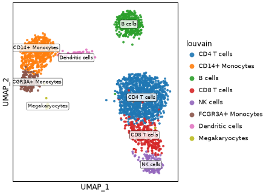 |
| 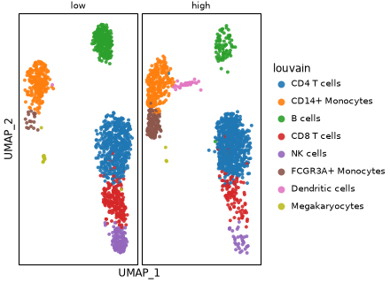 | 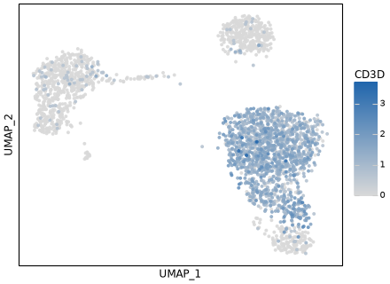 |

Density contours and binned counts use ordinary plotnine layers:

```python
from plotnine import aes, geom_bin2d, geom_density_2d, ggplot

density = ag.plot_embedding(adata, "umap", color=group) + geom_density_2d(
    color="black"
)

coords = ag.embedding_coords(adata, "umap")
x, y = coords.columns[:2]
hexbin = ggplot(coords, aes(x, y)) + geom_bin2d(bins=28)
```

| | |
|:---:|:---:|
| 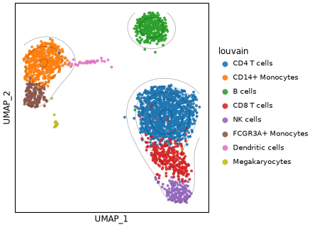 | 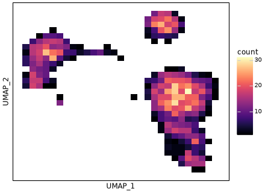 |

Features that require lineage fits, velocity estimates, neighbour graphs,
three-dimensional rendering, or embedded charts are outside ggann's data and
plotting model.

## FeatureStatPlot

| scplotter option | ggann |
|---|---|
| Default violin | `ag.plot_violin(adata, genes, group)` |
| `add_point=TRUE` | `ag.plot_violin(..., add_points=True)` |
| `plot_type="box"` | `ag.plot_box(adata, genes, group)` |
| `plot_type="bar"` | `ag.plot_expression_bar(adata, genes, group)` |
| `stack=TRUE` | `ag.plot_stacked_violin(adata, genes, group)` |
| `comparisons=TRUE` | `ag.plot_violin(..., stats=True)` |
| `plot_type="heatmap"` | `ag.plot_matrixplot(adata, genes, group)` |
| `plot_type="dot"` | `ag.plot_dotplot(adata, genes, group)` |
| `plot_type="cor"` | `ag.plot_correlation(adata, group, genes=genes)` |
| `plot_type="ridge"` | `ag.plot_ridge(adata, genes, group)` |

| | |
|:---:|:---:|
| 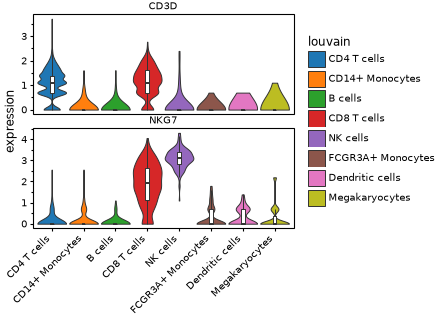 | 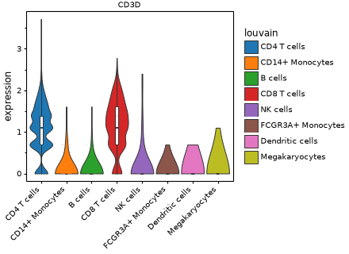 |
| 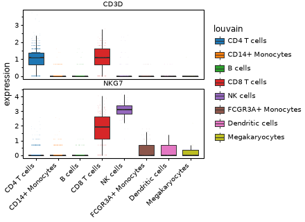 | 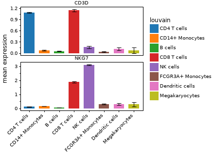 |
|  | 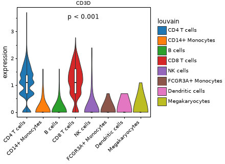 |
|  |  |
| 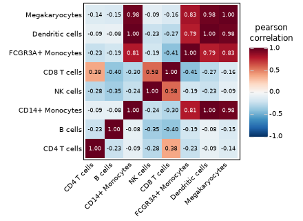 | 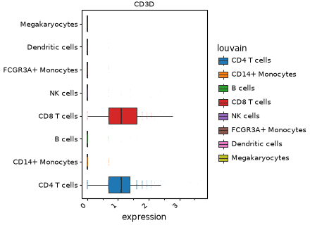 |

Custom summaries and coordinate changes remain plotnine operations:

```python
import numpy as np
from plotnine import coord_flip, stat_summary

with_mean = ag.plot_violin(adata, ["CD3D"], group, add_box=False) + stat_summary(
    fun_y=np.mean,
    geom="point",
)
flipped = ag.plot_box(adata, ["CD3D"], group) + coord_flip()
```

Annotated grid heatmaps can use `plot_clustermap`; correlation pairs matrices
and lineage-aware feature plots are not implemented.
